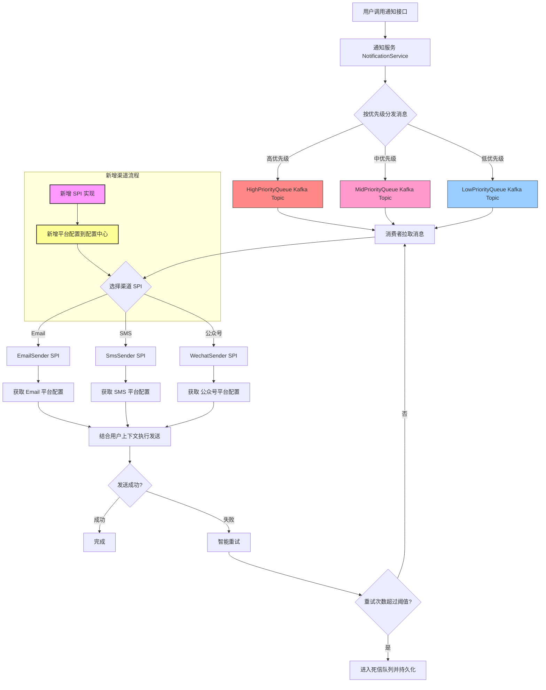

# 公司级别的通知系统：多渠道 / 优先级 / 智能重试

> **背景：** 作为高级开发，我经常需要从 0 到 1 设计一个支撑业务持续增长的子系统，下面是当时的完整记录与思考。

## **S（Situation）——背景**

> 我们设计公司级通知系统，面对大量上游业务方接入，通知渠道多样（Email、微信、钉钉、短信、App、MQTT 等），并发量高，但实时性要求不高。
>  用户触达率和可靠性是核心目标，同时系统必须可扩展、可定制，并且支持不同业务方的优先级和重试需求。

------

## **T（Task）——任务**

> 构建一个高可用、可扩展、可定制的通知系统，解决以下核心问题：
>
> - 多渠道接入与动态扩展
> - 并发处理与高优先级任务保障
> - 消息可靠投递、幂等性与智能重试
> - 系统稳定性和降级策略

------

## **A（Action）——行动 / 技术亮点**

### **1️⃣ 优先级队列与动态调度**

- 使用 **Priority Kafka Client**（开源实现）按权重轮询多个 Kafka Topic
- 高优先级通知（如密码重置、系统告警）保证快速发送
- 低优先级通知通过 **降级策略**批量慢发，保证资源利用和系统稳定
- 支持动态调整优先级、批量发送和限流
- 不同渠道单独队列，队列内部按优先级分层，实现灵活调度

### **2️⃣ 多渠道 SPI 扩展**

- 通知系统接口统一，不受渠道变化影响
- SPI 抽象不同渠道，支持 **自定义 Jar 包动态加载**
- 新增渠道无需改动核心逻辑即可上线，实现低耦合可扩展设计
- SPI 内部结合 **平台级配置 + 用户上下文** 完成发送

### **3️⃣ 平台级配置 + 用户参数分层**

- **平台级配置**：渠道公共参数（如短信网关、邮件服务器、公众号 AppID）通过配置中心管理，可动态注入
- **用户参数**：每次发送的内容、接收人、模板参数通过统一上下文传递
- 新增渠道仅需添加 SPI 和配置，用户绑定信息由产品层新增表和接口管理

### **4️⃣ 智能重试与死信处理**

- 支持业务方传入 QoS 参数控制重试策略
- 按退避策略（15s、30s、3m、10m……）逐步重试
- 多次失败进入死信队列并持久化，提供回调查询

### **5️⃣ 幂等与可靠投递**

- 设计全局唯一消息 ID + 幂等校验，防止重复发送
- 队列支持至少一次或仅一次投递，可根据业务灵活配置

### **6️⃣ 用户偏好与定制化**

- 用户偏好统一管理（渠道、频率、退订规则）
- 支持业务方自定义 QoS 和优先级，但最终由平台统一决策

------

## **R（Result）——成果亮点**

- 高优先级任务即时发送，低优先级任务合理降级，资源利用率高
- 多渠道接入灵活可扩展，新增渠道零改动核心代码
- 用户偏好统一管理，触达率和用户体验显著提升
- 系统具备高可靠性和幂等性，应对高并发和异常场景

------

## **面试主动亮点 / 技术点可追问**

1. **优先级队列设计**
   - 按权重拉取不同 Kafka Topic
   - 高优先级没有消息时，动态分配消费比例给中低优先级
   - 降级策略设计保证低优先级不饿死
2. **SPI 扩展机制**
   - 动态注入平台配置
   - 用户上下文统一传递参数
   - 新增渠道无需修改核心逻辑
3. **平台级配置与用户绑定**
   - 平台配置动态注入
   - 用户绑定信息属于业务层面，新增渠道需要表结构和接口改造
4. **智能重试**
   - 支持不同业务方 QoS
   - 可配置退避策略、死信队列和回调接口
5. **幂等与可靠投递**
   - 全局唯一消息 ID + 幂等校验
   - 队列支持至少一次 / 仅一次投递
6. **面试可能追问**
   - Kafka 多 Topic 消费策略实现
   - 如何保证低优先级消息不饿死
   - 新增渠道流程和动态注入实现
   - 用户参数上下文如何传递和扩展

